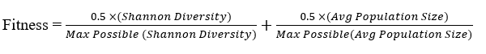
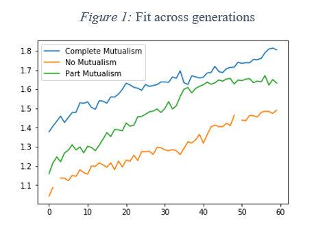
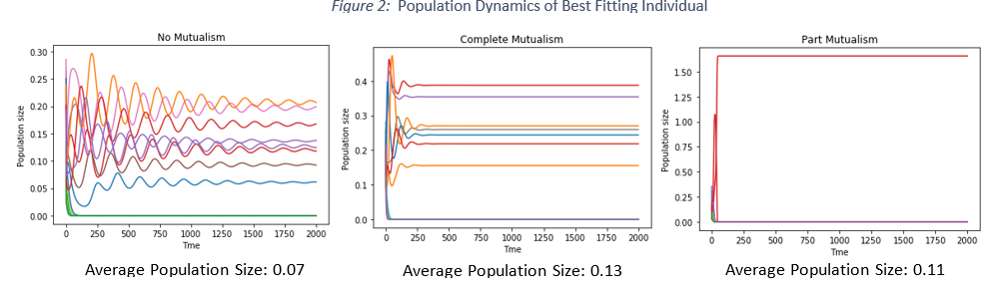

# mutualism_competition
Modelling effects of mutualism and competition on population dynamics using genetic algorithms.

Contains code for GA (ga.py), mutualism-competition model (agent_species_mutcomp.py), and running the model (run_trial.py).

## Aim
Investigating the interactions of mutualistic relationships and competitive relationships and quantifying their impact on biodiversity. Results of this study are not only relevant to ecological contexts but also human cultural contexts where competition can play an important role (e.g., economy).

## Background
Ecological systems are often a delicate balance of different types of symbiotic relationships between species contained in it. Any changes in quality or quantity of interactions can produce severe instability in population dynamics. Research has emphasized that ecological systems have evolved to have a deliberate structure with the aim of increasing stability to prevent extinction (Jordano, Bascompte, & Olesen, 2003). One such potential mechanism of increasing stability is interconnected mutualistic relationships between species (Bastolla at al., 2013). The current paper explores the scope of mutualistic relationships in reducing the debilitating impact of competition and thus increasing biodiversity.
The logic is as follows: If one set of species that compete against one another for common resources (e.g., plants) have complete interconnected mutualistic relationships with another set of species that also compete against each other (e.g., insects), an indirect mutualistic relationship is established between the competing species. For instance, if the population of one species of plants reduces, the population of all insect species reduces, reducing the population of other species of plants. Hence, the health of all plant populations is dependent on one another, even though they compete for common resources.

## Methods
### Conditions:
To study this concept, an ecosystem was created, composed of 15 competing plants and 15 competing insects. The degree of mutualistic interactions was varied across three conditions:
(1)	No mutualism: Plants and insects did not share a mutualistic relationship. Hence, competition between them was unaffected by mutualism.
(2)	Complete mutualism: All plants had mutualistic relationships with all insects. I expect this condition to produce greatest biodiversity, as impact of competition is reduced by the establishment of indirect mutualism between competing species.
(3)	Part mutualism: Each plant had a mutualistic relationship with only one insect and there was no overlap between these relationships. This interaction will perhaps produce the most unstable ecosystem since the competition between plants is exacerbated by competition between insects and vice versa.

### Experimental Questions:
(1)	How quickly does biodiversity increase across the conditions in an evolutionary algorithm?
(2)	What is the highest level of biodiversity that can evolve across the conditions?

### Genetic Algorithm:
To investigate these questions, a generational genetic algorithm was employed. Total of 40 individuals were evolved across 60 generations. Genotype of individuals served as parameters of the population dynamic equation (described below). In each generation, two individuals, chosen randomly from the population, competed against each other. The individual with higher biodiversity (defined further below) transferred approximately half of his genotype to the loser. Thus, at the end of the generations, we were able to obtain and compare the fittest parameters across the conditions.

### Dynamical System:
The following ODE was used to model effects of mutualism and competition:

In the above equation, x_i is the population of plant species i; r_i is its growth rate; α_ij is its degree of competition with plants species j; y_k is the population of insect species k; γ_ik is the degree of mutualistic interaction between plant i and insect k;  and h is the handling capacity. The middle term specifies the impact of competition and the last terms specifies that of mutualism. 
Parameters r_i, α_ij, and γ_ik  were free to evolve and ranged between 0.5 and 1.5. Starting populations of plants and animals (x_i  and y_k) were randomly picked from a normal distribution with mean 0.5 and SD 0.1. Handling time h was fixed at 1.
While the above equation has focused on plant populations, the exact equation was created for insect populations with plant and insect terms switched. It is not necessary that γ_ik= γ_ki, since plant and insect species could differ in the benefit they obtained from each other. The results described below are also focused on plant populations for purpose of clarity and simplicity.

### Fitness Measure
A combination of Shannon Index of Biodiversity and average population level was used:

This ensured that fitness was a product of larger number of species, larger populations of each species, and equal distribution of each species.

## Results
Figure 1 displays the average fit of individuals across generations for the three conditions. As can be seen, Complete Mutualism has highest fit. Further, it appears that Part Mutualism has higher fit than No Mutualism, however Figure 2 (which displays the population dynamics of best fitting individual) indicates that in Part Mutualism, most species perish and the inflated fitness is produced by large population sizes of few species. Figure 1 also suggests that No Mutualism has lowest fit. This is in spite of both having the same Shannon Biodiversity as Complete Mutualism (around 3.5). The lower fit is produced by lower average population size— average population of Complete Mutualism is almost double that of No Mutualism (0.13 versus 0.7), indicating a healthier ecosystem. These findings are largely according to what we expected. Higher fitness of Part Mutualism over No Mutualism was not hypothesized, but it is clear from looking at its population dynamics that it is more unstable than No Mutualism, but has an inflated fitness due to higher average population size.

